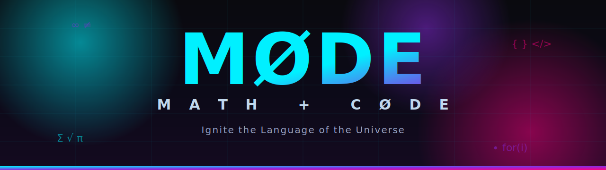

<div align="center">



# MØDE — Math + cØDE

> ### *"Ignite the Language of the Universe"*
> Children learning mathematics **through code**, taught by a Socratic AI tutor, inside a company that largely runs itself.

<p>
  
  
  
  
</p>

**Math + cØDE** — where the `Ø` is the empty set ∅.

</div>

---

MØDE is an **AI-operated educational platform** that teaches children aged 5–15 mathematics by using **coding as the primary medium for mathematical exploration**. It replaces rote memorization with computational thinking, logic, and project-based discovery.

The project is a hackathon entry for the **Hermes Agent Accelerated Business Hackathon** (presented by Nous Research, NVIDIA, and Stripe; deadline 30 June 2026), where MØDE is positioned not just as an ed-tech product but as a **bounded autonomous corporation** — an AI that can teach, earn, and spend, with humans on the loop.

---

## ❄️ Our story

We are **three developers from South Africa**. We didn't start with a lab, a grant, or a server rack. We started with a frustration we couldn't shake.

We grew up around classrooms where maths was something to *survive*, not love. Thirty-plus kids to a teacher. Rote drills. A quiet message, repeated until it stuck: *some people just aren't "maths people."* We watched bright, curious friends count themselves out of futures they could have owned, not because they couldn't think, but because nobody ever showed them that maths is just **logic you can play with**, and that code is the place you get to play.

So we decided to build the thing we wished we'd had: a patient tutor that never sighs, never rushes, never makes a child feel small for asking. One that teaches maths *through* code, one question at a time, meeting every learner exactly where they are.

We had no funding. What we had was a **second-hand x96 Android TV box** with **2 GB of RAM and 32 GB of storage**, sitting on a desk between the three of us. That little box is our entire "data centre." Every line of this project, every page of research, every late night, runs on hardware that costs less than a textbook. When people ask how a company can run on "structurally low marginal cost," we don't theorise. We point at the box.

It's not glamorous. It overheats. We've restarted it more times than we can count. But it's *ours*, and it's proof of the only thing we really believe: that the next kid who thinks they're "not a maths person" is wrong, and that you don't need a fortune to prove it to them. You need patience, a good idea, and a refusal to quit.

> Built from Mzansi 🇿🇦, on 2 GB of RAM and a whole lot of stubbornness.

---

## 🧭 At a glance

| | |
|---|---|
| **Name** | MØDE (Math + Code) |
| **Tagline** | "Crafting Mathematical Minds with Code Adventures" |
| **Audience** | Children aged 5–15, plus their parents/guardians |
| **Core idea** | Learn math *through* coding, guided by a Socratic AI tutor |
| **Built by** | The Dev Glacier @ Active Ice Digital |
| **Built for** | Hermes Agent Accelerated Business Hackathon (Nous Research × NVIDIA × Stripe) |
| **Current state** | Static marketing/pitch site + supporting research & product documentation |

---

## 📦 What's in this repository

This repository is currently a **pitch and concept package** — a polished static website that presents the MØDE vision, backed by a body of research and product-definition documents. It is **not yet the learning application itself**.

```
MØDE/
├── README.md                   # This file — project entry point
├── assets/
│   └── banner.png              # Repo banner graphic (top of this README)
│
├── demo-site/                  # Static pitch/concept site (vanilla HTML/CSS/JS)
│   ├── index.html              #   Main landing page — the MØDE Core pitch
│   ├── style.css               #   Landing-page styling (cyberpunk/glassmorphism)
│   ├── script.js               #   Parallax + smooth-scroll interactions
│   ├── mode-scholars.html      #   "MØDE Scholars" elite-tier page
│   ├── mode-scholars.css       #   Scholars-page styling (gold/violet theme)
│   ├── onboarding.html         #   Onboarding flow mockup
│   ├── learner-dashboard.html  #   Learner dashboard mockup
│   ├── lesson-view.html        #   Lesson view mockup
│   ├── parent-dashboard.html   #   Parent dashboard mockup
│   └── assets/
│       └── mode_hero.png       #   Hero graphic
│
├── docs/                       # Planning, business & research documents
│   ├── MØDE_Business_Documentation.md   # Concise business/architecture summary
│   ├── PROJECT_EVALUATION.md            # Critique & prioritized next steps
│   ├── TECH_STACK_RECOMMENDATION.md     # Tech-stack analysis
│   ├── CHILD_SAFETY_POLICY.md           # Child-safety & privacy policy
│   ├── extract.py                       # Utility: .docx → markdown into research/
│   ├── source-docx/                     # Original source documents (.docx)
│   └── research/                        # Extracted & authored research notes (markdown)
│
└── hermes/                     # Hermes agent configuration, skills & docs
    ├── hermes-agent-docs.md    #   Agent documentation
    ├── AGENTS.md · SOUL.md · USER.md · MEMORY.md · README.md
    ├── config.yaml · .env.example
    └── skills/                 #   Curriculum skill modules
```

> **Note on naming:** The product is branded **MØDE** in the current site and business docs. Several source documents in `docs/research/` and the `.docx` files refer to an earlier name, **MathCraft Kids** — these describe the same underlying product. MØDE is the evolved, hackathon-facing identity.

---

## 💡 The vision

### Pedagogy — code as a medium for math

MØDE's central premise is that programming produces **measurable transfer to mathematical skill**, strongest when the target skill is close to the code. The pitch cites meta-analytic support (overall transfer *g* ≈ 0.49) and positions a Socratic AI tutor as outperforming group instruction (*g* ≈ 0.42).

To avoid overwhelming novices, the tutor uses **Socratic escalation** rather than handing out answers:

```
Question  →  Hint  →  Partial Example  →  Direct Explanation
```

This keeps each learner in their *zone of proximal development* while preventing working-memory overload.

### Age-tiered curriculum

| Tier | Ages | Focus |
|---|---|---|
| 🧩 **Early Explorers** | 5–7 | Visual, block-based logic; pattern recognition, spatial reasoning, early number sense |
| 🛠️ **Middle Ground Builders** | 8–12 | Python & JavaScript project-based learning; variables (algebra) and coordinates (geometry) via game development |
| 🚀 **Teen Engineers** | 13–15 | Text-based coding; calculus concepts, data analysis, and basic machine-learning principles |

The detailed curriculum (`docs/research/Learning Modules Outline.md`) spans Number Sense & Arithmetic, Shapes & Geometry, Patterns & Sequences, Logic & Reasoning, Data & Measurement, Algebraic Thinking, Creative Problem Solving, Introduction to Coding Concepts, and Game Development.

### Two product tiers

- **MØDE Core** — accessible, one-to-one Socratic tutoring to help students gain ground and build foundational confidence.
- **MØDE Scholars** — an invitation/waitlist-based elite enrichment program for profoundly gifted youth, emphasizing curriculum compacting, divergent thinking, metacognition, and interdisciplinary problem solving.

---

## 🤖 The "fully automated company" angle

For the hackathon, MØDE is framed as a **bounded autonomous corporation** built on four interoperable layers:

| Layer | Technology | Role |
|---|---|---|
| **Orchestrator** | Hermes Agent | Runtime with persistent cross-session memory + autonomous skill loop |
| **Reasoning Brain** | NVIDIA Nemotron 3 Ultra | Routed by difficulty, with reasoning-budget control |
| **Safety Cage** | NVIDIA NemoClaw | OpenShell sandbox, declarative egress policy, child-safety policy enforcement |
| **Wallet** | Stripe Agent Toolkit | Scoped, spend-capped, delegated agent identities to pay for services |

**Bounded autonomy** is the operating principle (explicitly informed by Anthropic's *Project Vend*): short, checkpointed, recoverable steps run within hard limits — scoped Stripe keys, spend caps, NemoClaw egress rules — with **humans owning the judgement calls**. Rather than claiming "$0 overhead," the pitch argues for *structurally low marginal cost* via serverless hibernation, model right-sizing, and reasoning-budget caps.

> ⚠️ **Important:** The technologies above describe the *intended* architecture as presented in the pitch. The current repository does **not** contain a live integration with Hermes, NVIDIA Nemotron/NemoClaw, or Stripe — these are the planned/claimed stack, not implemented code.

---

## 🛡️ Child safety & privacy

A product for 5–15-year-olds triggers the strictest tier of privacy law in every major market. The pitch identifies this as the **gating constraint** and names the relevant regimes:

- **COPPA (US)** — verifiable parental consent, separate consent for third-party disclosure, data minimization.
- **Children's Code (UK)** — high privacy by default, profiling off, no manipulative nudge techniques (careful gamification).
- **GDPR & POPIA (EU / South Africa)** — store *pedagogical state* (mastery, ZPD position) rather than raw session transcripts.

The supporting PRD additionally references **FERPA**, **PCI DSS**, and **WCAG** accessibility standards. See `docs/CHILD_SAFETY_POLICY.md`.

---

## 🎨 Tech & design

The current site is **vanilla HTML / CSS / JavaScript** — no framework or build step.

- **Design language:** dark mode with vibrant neon accents (cyberpunk/futuristic), glassmorphism panels, glow orbs, and responsive micro-animations.
  - *MØDE Core* palette: cyan `#00f0ff`, magenta `#ff007f`, violet `#8a2be2` on near-black `#0a0a0f`.
  - *MØDE Scholars* palette: gold `#d4af37` and violet `#7b61ff` for a more premium, exclusive feel.
- **Fonts:** Inter (body) and Outfit (display), via Google Fonts; Font Awesome icons on the Scholars page.
- **Interactions:** mouse-driven parallax on the hero/orbs and smooth anchor scrolling (`script.js`); IntersectionObserver scroll-reveal on the Scholars page.

> The PRD envisions the *eventual* application being built on **React and Next.js** with JWT authentication, a relational or NoSQL datastore, and a parental admin dashboard — none of which is present in this repo yet.

---

## ▶️ Running the site

No build tooling is required. Either open the files directly or serve the folder:

```bash
cd demo-site

# Option 1 — open directly
open index.html          # macOS
start index.html         # Windows

# Option 2 — serve locally (recommended, for correct relative paths)
python -m http.server 8000
# then visit http://localhost:8000
```

Navigation: `index.html` (MØDE Core) ↔ `mode-scholars.html` (MØDE Scholars) are cross-linked, along with the onboarding, learner, lesson, and parent dashboard mockups.

### Regenerating research notes

`docs/extract.py` converts every `.docx` in `docs/source-docx/` into a markdown file under `docs/research/`:

```bash
cd docs
python extract.py
```

It reads `word/document.xml` from each `.docx` (no external dependencies) and writes `research/<name>.md`.

---

## 🗺️ Status & roadmap

| | |
|---|---|
| ✅ **Today** | A high-fidelity concept site and a thorough research/PRD package — strong as a pitch and product blueprint. |
| 🔜 **Not yet built** | The actual learning application (interactive coding terminals, lessons, assessments, gamification engine, parental dashboard, authentication) and any real Hermes / NVIDIA / Stripe integration. |

For a fuller critique and prioritized next steps, see **`docs/PROJECT_EVALUATION.md`**.

---

<div align="center">

*Built for the **Hermes Agent Accelerated Business Hackathon** by **The Dev Glacier @ Active Ice Digital**.*

**MØDE** · *Math + cØDE* · Ignite the Language of the Universe

</div>
